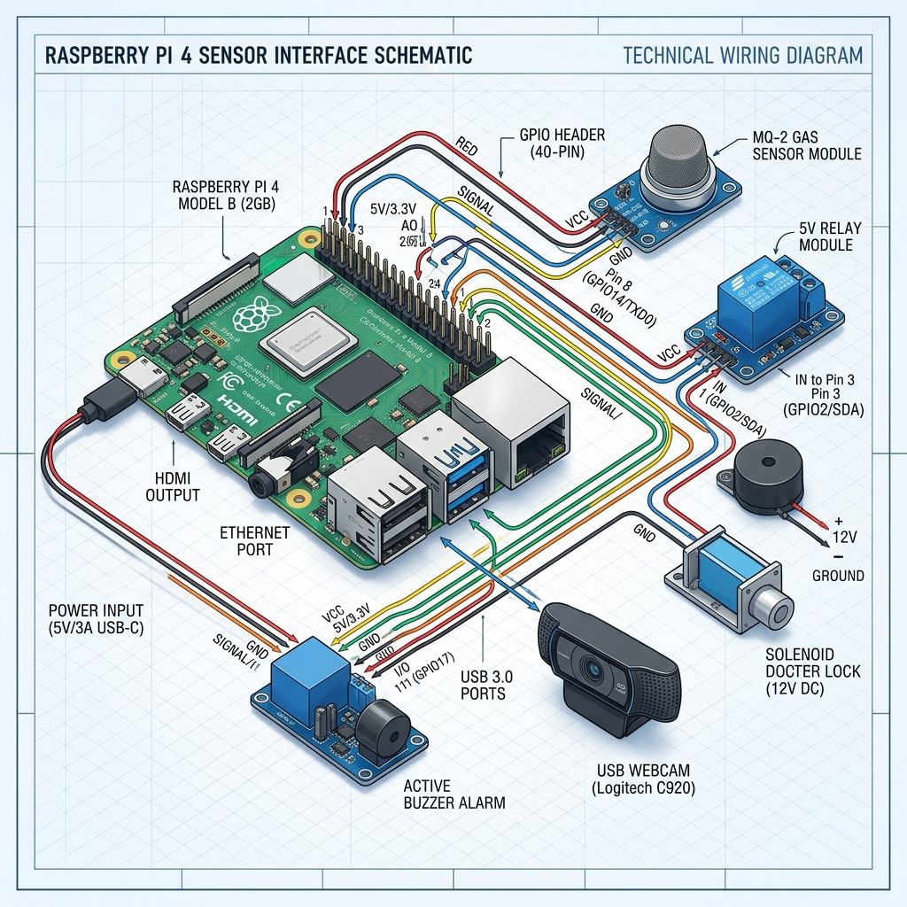

# HƯỚNG DẪN CẮM DÂY VÀ KẾT NỐI PHẦN CỨNG RASPBERRY PI 4

Tài liệu này hướng dẫn chi tiết cách cắm các cổng kết nối ngoại vi, nguồn cấp và mạng LAN trên bo mạch **Raspberry Pi 4 Model B** để tạo thành một nút biên (Edge Node) AI hoàn chỉnh kết nối với máy tính cá nhân (Laptop) và Camera.

---

## 1. Sơ đồ kết nối phần cứng (ASCII Diagram)

```text
               +----------------------------------------------------+
               |                RASPBERRY PI 4 MODEL B              |
               |                                                    |
  [Quạt 5V] --->| [GPIO Pins]  (Cắm chân Đỏ -> chân 4, Đen -> chân 6)
 [Cảm biến Ga]->|              (VCC -> chân 2 (5V), GND -> chân 9, DO -> chân 12 (GPIO 18))
 [Khóa/Rơ-le] ->|              (VCC -> chân 4 (5V) chia sẻ, GND -> chân 14, IN -> chân 16 (GPIO 23))
 [Còi báo động]->|             (VCC -> chân 2 (5V) chia sẻ, GND -> chân 14 chia sẻ, IN -> chân 18 (GPIO 24))
                |                                                    |
 [Nguồn USB-C] | [USB-C Port] (Nguồn cấp chính hãng 5V-3A)          |
   (Cắm điện)  |                                                    |
               | [Micro-HDMI] (Cổng HDMI 1 - Xuất màn hình tùy chọn)|
               |                                                    |
               | [USB 2.0 - Đen]                                    |
               | [USB 2.0 - Đen]                                    |
               |                                                    |
 [USB Webcam] -| [USB 3.0 - Xanh] (Cắm Webcam ở đây để có tốc độ cao)|
               | [USB 3.0 - Xanh]                                   |
               |                                                    |
  [Cáp Mạng] --| [Ethernet RJ45] (Kết nối mạng LAN cùng với Laptop)  |
               +----------------------------------------------------+
                        |
                        | (Cáp Ethernet RJ45 hoặc kết nối qua Wi-Fi)
                        v
               +----------------------------------------------------+
               |                  ROUTER WI-FI / SWITCH             |
               |       (Cấp phát địa chỉ IP cho Pi 4 và Laptop)     |
               +----------------------------------------------------+
                        ^
                        | (Kết nối cùng mạng LAN của Router)
                        v
               +----------------------------------------------------+
               |                 LAPTOP CÁ NHÂN (CLIENT)            |
               |       (Dùng để điều khiển SSH & Xem Web Dashboard)  |
               +----------------------------------------------------+
```

---

## Sơ đồ đấu nối trực quan (Visual Wiring Diagram)



---

## 2. Sơ đồ các chân cắm GPIO chi tiết (Detailed Pinout Header)

Dưới đây là sơ đồ mặt bằng hàng chân cắm **40-Pin GPIO** trên Raspberry Pi 4, hiển thị rõ số thứ tự chân vật lý (1-40) để bạn dễ đối chiếu khi cắm dây:

```text
                                MẶT TRÊN BO MẠCH (TOP VIEW)
                             Hàng Lẻ (Trong)    Hàng Chẵn (Ngoài)
                            +------------------------------------+
                            |  3.3V Power  (1)  (2)  5V Power [Đấu Ga/Còi VCC]
                            |  GPIO 2      (3)  (4)  5V Power [Đấu Quạt/Rơ-le VCC]
  [Cực âm Quạt GND] <-------|  GND (Mát)   (5)  (6)  GND (Mát) [Đấu dây Đen Quạt]
                            |  GPIO 4      (7)  (8)  GPIO 14
   [Ga MQ-2 GND] <----------|  GND (Mát)   (9)  (10) GPIO 15
                            |  GPIO 17    (11)  (12) GPIO 18  [Đấu Ga MQ-2 DO]
                            |  GPIO 27    (13)  (14) GND (Mát) [Đấu Rơ-le/Còi GND]
  [Đấu Rơ-le IN] <----------|  GPIO 22    (15)  (16) GPIO 23
                            |  3.3V       (17)  (18) GPIO 24  [Đấu Còi báo IN]
                            |  GPIO 10    (19)  (20) GND (Mát)
                            |  GPIO 9     (21)  (22) GPIO 25
                            |  GPIO 11    (23)  (24) GPIO 8
                            |  GND (Mát)  (25)  (26) GPIO 7
                            |  GPIO 0     (27)  (28) GPIO 1
                            |  GPIO 5     (29)  (30) GND (Mát)
                            |  GPIO 6     (31)  (32) GPIO 12
                            |  GPIO 13    (33)  (34) GND (Mát)
                            |  GPIO 19    (35)  (36) GPIO 16
                            |  GPIO 26    (37)  (38) GPIO 20
                            |  GND (Mát)  (39)  (40) GPIO 21
                            +------------------------------------+
```

---

## 3. Bảng tra cứu đấu nối thiết bị theo số thứ tự chân (GPIO Connection Table)

Để tránh cắm nhầm chân gây chập cháy thiết bị, bạn hãy thực hiện kết nối đúng theo bảng số chân vật lý chi tiết dưới đây:

| Số Chân Vật Lý | Tên Chân (GPIO) | Thiết Bị Ngoại Vi | Đầu Dây Thiết Bị | Cách Đấu Nối & Ghi Chú |
| :---: | :--- | :--- | :---: | :--- |
| **2** | 5V Power | Cảm biến Ga MQ-2 & Còi báo động | **VCC** / **(+)** | **Đấu chung**: Nối 2 đầu dây VCC (Nguồn dương) của cảm biến Ga và Còi hú vào chân này. |
| **4** | 5V Power | Quạt tản nhiệt & Module Rơ-le | **VCC** / **(+)** | **Đấu chung**: Nối dây Đỏ của quạt và dây nguồn VCC của Module Rơ-le vào chân này. |
| **6** | Ground (GND) | Quạt tản nhiệt | **GND** / **(-)** | Nối dây Đen (Cực âm) của Quạt tản nhiệt vào chân này. |
| **9** | Ground (GND) | Cảm biến Ga MQ-2 | **GND** | Nối dây mát (GND) của cảm biến khí ga MQ-2 vào chân này. |
| **12** | GPIO 18 | Cảm biến Ga MQ-2 | **DO** (Digital Output) | Nhận mức Logic (HIGH/LOW) báo hiệu rò rỉ khí Ga. |
| **14** | Ground (GND) | Module Rơ-le & Còi báo động | **GND** | **Đấu chung**: Nối 2 dây GND của module Rơ-le và Còi hú vào chân này. |
| **16** | GPIO 23 | Module Rơ-le mở cửa | **IN** | Xuất mức logic HIGH điều khiển hút Rơ-le để kích hoạt mở khóa Solenoid. |
| **18** | GPIO 24 | Còi báo động (Active Buzzer) | **IN** / **I/O** | Xuất nhịp xung điều khiển còi hú (Báo cháy, Ga hoặc Xâm nhập). |

*Mẹo cắm chung dây (Chia cổng VCC/GND)*: Do Raspberry Pi 4 chỉ có số lượng chân 5V và GND giới hạn, bạn nên sử dụng **Jack nối chia cổng**, **Breadboard (test board)**, hoặc hàn chụm các đầu dây nguồn/GND lại với nhau rồi cắm vào hàng chân Pi để giữ mối nối gọn gàng và chắc chắn.

---

## 4. Hướng dẫn cắm dây từng bước

### Bước 1: Cài đặt thẻ nhớ MicroSD
* Đảm bảo thẻ nhớ MicroSD đã được flash hệ điều hành (Raspberry Pi OS hoặc Ubuntu Server).
* Cắm thẻ nhớ vào khe cắm thẻ nhớ ở **mặt dưới** của bo mạch Raspberry Pi 4 (lưu ý cắm đúng chiều mặt đồng quay về phía mạch).

### Bước 2: Lắp quạt tản nhiệt (Active Cooler)
* Dán các miếng truyền nhiệt (Thermal Pad) lên chip CPU, RAM và chip quản lý nguồn của Pi.
* Đặt quạt tản nhiệt lên và cắm dây cấp nguồn cho quạt vào chân GPIO ở hàng chân cắm:
  * **Dây màu Đỏ (Cực dương 5V)**: Cắm vào **Chân số 4** (Hàng ngoài, chân thứ 2 tính từ bên trái sang).
  * **Dây màu Đen (Cực âm GND)**: Cắm vào **Chân số 6** (Hàng ngoài, chân thứ 3 tính từ bên trái sang).
  *(Lưu ý: Nếu quạt có jack cắm 3 chân/4 chân chuyên dụng và vỏ case hỗ trợ, hãy cắm đúng theo khe hướng dẫn).*

### Bước 3: Cắm USB Webcam
* Bạn cắm cổng kết nối của USB Webcam vào một trong hai cổng **USB 3.0 (Cổng có lõi nhựa màu xanh dương)** trên Raspberry Pi 4.
* *Tại sao cần cắm cổng USB 3.0?* Cổng USB 3.0 có băng thông truyền tải dữ liệu hình ảnh lớn hơn nhiều so với cổng USB 2.0 (màu đen), giúp giảm độ trễ truyền khung hình từ webcam vào mô hình AI xử lý.

### Bước 4: Kết nối mạng (Mạng LAN hoặc Wi-Fi)
* **Cách 1 (Khuyên dùng khi báo cáo)**: Cắm một đầu cáp mạng LAN (RJ45) vào cổng **Ethernet** của Raspberry Pi 4, đầu còn lại cắm vào bộ **Router Wi-Fi** hoặc **Switch**. Máy tính cá nhân (Laptop) của bạn cũng kết nối vào cục Router Wi-Fi này để tạo thành một mạng nội bộ (LAN).
* **Cách 2 (Không dây)**: Nếu không có cáp mạng, bạn cấu hình kết nối Wi-Fi cho Raspberry Pi 4 kết nối cùng mạng Wi-Fi với Laptop.

### Bước 5: Cắm màn hình điều khiển (Tùy chọn)
* Nếu bạn muốn nhìn trực tiếp màn hình Desktop của Pi để cấu hình, hãy cắm cáp **Micro-HDMI** vào cổng HDMI sát cổng nguồn USB-C của Pi, đầu còn lại cắm vào cổng HDMI của màn hình máy tính/TV.

### Bước 6: Cắm nguồn điện USB-C
* Cắm đầu dây USB-C của củ nguồn điện chính hãng (5V-3A) vào cổng nguồn **USB-C** trên Pi.
* Cắm củ nguồn vào ổ điện gia đình. Raspberry Pi 4 sẽ tự động khởi động (đèn đỏ sáng liên tục, đèn xanh lá nhấp nháy báo đọc thẻ nhớ).

### Bước 7: Cắm cảm biến khí ga MQ-2 (hoặc MQ-5)
Để mở rộng hệ thống giám sát rò rỉ khí ga phòng bếp (tác vụ an toàn bổ sung), bạn nối 3 dây từ cảm biến MQ-2 vào hàng chân GPIO của Raspberry Pi 4:
* **Chân VCC (Nguồn 5V)**: Nối vào **Chân số 2** (Hàng ngoài, chân đầu tiên bên trái) trên Pi 4 để lấy nguồn 5V.
* **Chân GND (Đất)**: Nối vào **Chân số 9** (Hàng trong, chân thứ 5 từ bên trái sang) hoặc bất kỳ chân GND nào của Pi.
* **Chân DO (Digital Output)**: Nối vào **Chân số 12 (GPIO 18)** trên Pi 4 để truyền tín hiệu cảnh báo số.
* *Cách căn chỉnh cảm biến*: Trên mạch MQ-2 có sẵn một núm xoay biến trở màu xanh dương. Bạn cắm điện vào Pi, dùng tuốc nơ vít nhỏ xoay nhẹ núm này sao cho trong điều kiện không khí thường đèn LED cảnh báo tắt, và khi bạn xịt nhẹ bật lửa (không đánh lửa) có gas vào đầu cảm biến, đèn LED lập tức sáng lên. Hệ thống sẽ tự động bắt mức tín hiệu này và kích hoạt còi cảnh báo + gửi tin Telegram trong vòng 1 giây.

### Bước 8: Cắm Rơ-le (Relay) để điều khiển mở Khóa cửa điện từ (Solenoid Lock)
Để kích hoạt tính năng mở cửa từ xa (bấm nút trên Telegram hoặc Web Dashboard), bạn kết nối module Rơ-le 5V điều khiển khóa từ vào Raspberry Pi 4 như sau:
* **Chân VCC (Nguồn 5V)**: Nối vào **Chân số 4** (Hàng ngoài, chân thứ 2 từ bên trái) trên hàng GPIO của Pi (bạn có thể dùng jack chia 5V hoặc nối chung với chân nguồn của Quạt 5V).
* **Chân GND (Đất)**: Nối vào **Chân số 14** (Hàng ngoài, chân thứ 7 từ bên trái) hoặc bất kỳ chân Ground trống nào trên Pi.
* **Chân IN (Tín hiệu điều khiển)**: Nối vào **Chân số 16 (GPIO 23)** trên Pi 4.
* **Đầu ra Relay (Cổng COM và NO)**: Đấu nối tiếp với nguồn cấp độc lập của khóa Solenoid (thường là nguồn tổ ong 12V-2A hoặc pin ngoài). Khi có lệnh mở cửa từ Telegram/Web, Pi sẽ xuất mức HIGH lên chân GPIO 23, hút cuộn dây Rơ-le làm thông mạch COM-NO để cấp điện mở khóa cửa trong 3 giây rồi tự động khóa lại.

### Bước 9: Cắm Còi báo động vật lý (Active Buzzer 5V)
Để hệ thống có thể hú còi báo động vật lý tại chỗ khi phát hiện hỏa hoạn, rò rỉ khí ga, hoặc có xâm nhập khi khóa nhà, bạn kết nối còi báo động 5V vào Raspberry Pi 4 như sau:
* **Chân VCC (Nguồn 5V)**: Nối vào **Chân số 2** (Hàng ngoài, chân thứ 1 từ bên trái) - đấu song song chia sẻ với VCC của cảm biến Ga.
* **Chân GND (Đất)**: Nối vào **Chân số 14** (Hàng ngoài, chân thứ 7 từ bên trái) - đấu song song chia sẻ với GND của module Rơ-le.
* **Chân I/O (Tín hiệu điều khiển)**: Nối vào **Chân số 18 (GPIO 24)** trên Pi 4.
* **Cơ chế hoạt động**: Khi hệ thống báo động kích hoạt, Pi sẽ xuất tín hiệu HIGH/LOW liên tục để hú còi theo nhịp:
  * *Báo cháy (Fire)*: Nhấp nháy còi cực nhanh (0.1 giây ON, 0.1 giây OFF).
  * *Rò rỉ khí Ga (Gas)*: Nhấp nháy còi chu kỳ vừa (0.3 giây ON, 0.3 giây OFF).
  * *Khóa nhà có xâm nhập (Intrusion)*: Nhấp nháy còi chu kỳ chậm (0.8 giây ON, 0.8 giây OFF).

---

## 5. Cách tìm địa chỉ IP của Raspberry Pi để kết nối từ Laptop

Khi Raspberry Pi 4 khởi động và nhận mạng từ Router, nó sẽ được cấp một địa chỉ IP nội bộ (ví dụ: `192.168.1.15`). Để kết nối từ Laptop vào Pi qua SSH hoặc Web, bạn cần biết IP này:

1. **Cách 1 (Dùng phần mềm quét IP)**: Tải phần mềm **Advanced IP Scanner** (miễn phí) trên Laptop $\rightarrow$ Nhấn **Scan** $\rightarrow$ Tìm thiết bị có tên nhà sản xuất là `Raspberry Pi Foundation` để lấy địa chỉ IP.
2. **Cách 2 (Xem trong trang cấu hình Router)**: Đăng nhập vào trang quản trị của Router Wi-Fi (thường là `192.168.1.1` hoặc `192.168.0.1`) $\rightarrow$ Xem danh sách thiết bị kết nối (DHCP Client List) để tìm địa chỉ IP của Raspberry Pi.
3. **Cách 3 (Dùng màn hình)**: Nếu có cắm màn hình HDMI vào Pi ở Bước 5, bạn chỉ cần mở Terminal trên Pi và gõ lệnh:
   ```bash
   hostname -I
   ```
   Địa chỉ IP sẽ hiển thị ngay trên màn hình.

---

## 6. Danh sách linh kiện cần mua (Hardware Shopping List)

Để chuẩn bị đầy đủ phần cứng lắp đặt hệ thống, bạn có thể tham khảo danh sách mua sắm linh kiện chi tiết dưới đây:

### Nhóm 1: Thiết bị điều khiển trung tâm & Phụ kiện cơ bản
| STT | Tên Linh Kiện | Thông Số Kỹ Thuật Khuyên Dùng | Số Lượng | Vai Trò Trong Hệ Thống | Giá Tham Khảo (VND) |
| :---: | :--- | :--- | :---: | :--- | :---: |
| **1** | **Raspberry Pi 4 Model B** | RAM 8GB (hoặc tối thiểu 4GB) | 01 cái | Chạy hệ điều hành, các mô hình AI biên (YOLOv5, YOLOv8, FaceNet) và Uvicorn Server. | 1.800.000 - 2.200.000 |
| **2** | **Bộ nguồn USB-C Pi 4** | Nguồn chính hãng 5V - 3A | 01 cái | Cấp nguồn dòng cao, ổn định cho Pi và các cảm biến tránh sụt áp gây đơ CPU. | 200.000 - 250.000 |
| **3** | **Thẻ nhớ MicroSD** | 32GB hoặc 64GB (Class 10 tốc độ cao) | 01 cái | Lưu trữ hệ điều hành Raspberry Pi OS, mã nguồn dự án và các tệp video ghi hình. | 100.000 - 180.000 |
| **4** | **Vỏ case kèm quạt tản nhiệt** | Case nhựa/nhôm + Quạt 5V | 01 bộ | Bảo vệ bo mạch Pi 4 và giải nhiệt CPU khi hệ thống chạy AI liên tục 24/7. | 80.000 - 150.000 |

### Nhóm 2: Thiết bị thị giác & Phân hệ cảm biến - báo động
| STT | Tên Linh Kiện | Thông Số Kỹ Thuật Khuyên Dùng | Số Lượng | Vai Trò Trong Hệ Thống | Giá Tham Khảo (VND) |
| :---: | :--- | :--- | :---: | :--- | :---: |
| **5** | **USB Webcam** | Độ phân giải HD (720p) hoặc Full HD (1080p) (Logitech C270/C310 hoặc OEM) | 01 cái | Thu nhận luồng hình ảnh camera đưa vào mô hình AI nhận diện khuôn mặt, hỏa hoạn và ngã. | 350.000 - 650.000 |
| **6** | **Cảm biến khí Ga MQ-2** | Module MQ-2 có đầu ra Digital Output (DO) | 01 cái | Phát hiện nồng độ khí ga rò rỉ vượt ngưỡng an toàn trong phòng bếp. | 25.000 - 40.000 |
| **7** | **Còi báo động (Active Buzzer)** | Còi báo động chip còi 5V (Active 5V) | 01 cái | Hú còi cảnh báo tại chỗ theo tần số (Hỏa hoạn nháy nhanh, Ga vừa, Xâm nhập chậm). | 10.000 - 20.000 |
| **8** | **Module Rơ-le (Relay Module)** | Module 1-Kênh 5V kích mức Cao/Thấp | 01 cái | Làm công tắc đóng ngắt nguồn điện cấp cho khóa cửa điện từ Solenoid. | 20.000 - 35.000 |
| **9** | **Khóa cửa điện từ Solenoid** | Khóa Solenoid chốt tủ/cửa 12V | 01 cái | Mô phỏng khóa cửa an ninh điều khiển đóng/mở tự động từ xa. | 80.000 - 150.000 |
| **10** | **Nguồn cấp cho Khóa Solenoid** | Nguồn Adapter 12V - 2A (hoặc nguồn tổ ong) | 01 cái | Cấp nguồn riêng cho khóa Solenoid (tránh đấu chung nguồn Pi gây nhiễu/sụt áp). | 50.000 - 100.000 |

### Nhóm 3: Phụ kiện kết nối & Hỗ trợ báo cáo
| STT | Tên Linh Kiện | Thông Số Kỹ Thuật Khuyên Dùng | Số Lượng | Vai Trò Trong Hệ Thống | Giá Tham Khảo (VND) |
| :---: | :--- | :--- | :---: | :--- | :---: |
| **11** | **Dây cắm Jumper (Cáp nối)** | Dây cắm Cái - Cái (F-F) và Đực - Cái (M-F) | 1 vỉ (40 sợi) | Kết nối tín hiệu điều khiển giữa hàng GPIO của Pi 4 với cảm biến, rơ-le và còi hú. | 20.000 - 30.000 |
| **12** | **Testboard chia dây (Breadboard)** | Mini Breadboard 400 lỗ hoặc 170 lỗ | 01 cái | Sử dụng làm cầu nối trung gian chia cổng nguồn 5V và chân Ground (GND) cho gọn gàng. | 20.000 - 45.000 |
| **13** | **Cáp mạng Ethernet (LAN)** | Cáp đúc đầu RJ45 (dài 1.5m - 3m) | 01 sợi | Kết nối mạng LAN nội bộ ổn định giữa Pi 4 và Laptop cá nhân để SSH điều khiển hệ thống. | 15.000 - 30.000 |

*Tổng chi phí ước tính*: Dao động trong khoảng **2.800.000 - 3.800.000 VND** tùy thuộc vào nguồn hàng bạn lựa chọn (các linh kiện cảm biến và rơ-le đều rất rẻ và phổ biến tại các cửa hàng linh kiện điện tử).
